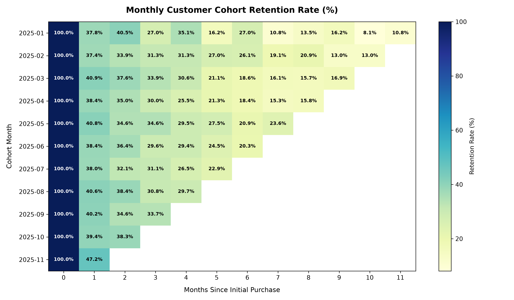
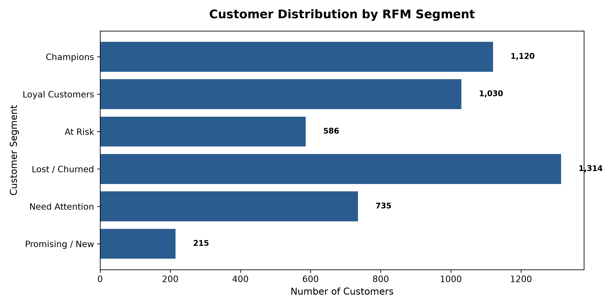

# Customer Cohort Retention & RFM Segmentation Analysis

## 📌 Project Overview
This project is an end-to-end analytical solution designed to evaluate **customer retention curves**, **cohort behavior**, and **customer value segmentation (RFM Framework)** for an e-commerce platform. 

Instead of relying on static CSV reports, this repository implements a complete analytics pipeline: generating synthetic transactional datasets (5,000+ customers, 16,000+ orders), modeling the data in a relational database schema using **PostgreSQL-compatible SQL**, executing advanced statistical queries via **Window Functions** and **CTEs**, and exporting an executive-facing **Excel Report (`Cohort_RFM_Report.xlsx`)** formatted with cohort retention matrices and KPI scorecards.

---

## 🛠️ Tech Stack & Key Skills
- **Data Engineering & Simulation:** Python (`pandas`, `numpy`, `random`)
- **Database & Query Optimization:** SQL (PostgreSQL syntax, CTEs, Window Functions `NTILE`, `DATE_TRUNC`, `MIN() OVER`)
- **Data Visualization & Analytics:** Matplotlib (`matplotlib.pyplot`, custom heatmap matrix, segment distribution charts)
- **Business Intelligence & Reporting:** Excel (`openpyxl`, Pivot-style summaries, Conditional Formatting, KPI Scorecards)
- **Environment:** Windows / WSL Python 3.12

---

## 🏗️ Project Architecture & Data Model

```
 ┌────────────────────────┐         ┌────────────────────────┐
 │       customers        │         │         orders         │
 ├────────────────────────┤ 1     * ├────────────────────────┤
 │ customer_id (PK)       ├─────────┤ order_id (PK)          │
 │ signup_date            │         │ customer_id (FK)       │
 │ country                │         │ order_date             │
 └────────────────────────┘         │ order_value            │
                                    │ status                 │
                                    └────────────────────────┘
```

---

## 💻 SQL Query Highlights (`schema_and_queries.sql`)

### 1. Cohort Retention Matrix (PostgreSQL CTEs & Window Functions)
Calculates monthly acquisition cohorts and tracks retention percentages across a 12-month timeline:

```sql
WITH first_purchases AS (
    SELECT 
        customer_id,
        MIN(order_date) AS first_order_date,
        DATE_TRUNC('month', MIN(order_date))::DATE AS cohort_month
    FROM orders
    WHERE status = 'Completed'
    GROUP BY customer_id
),
cohort_sizes AS (
    SELECT cohort_month, COUNT(DISTINCT customer_id) AS total_cohort_customers
    FROM first_purchases GROUP BY cohort_month
),
monthly_activities AS (
    SELECT 
        fp.cohort_month,
        fp.customer_id,
        (EXTRACT(YEAR FROM DATE_TRUNC('month', o.order_date)) - EXTRACT(YEAR FROM fp.cohort_month)) * 12 +
        (EXTRACT(MONTH FROM DATE_TRUNC('month', o.order_date)) - EXTRACT(MONTH FROM fp.cohort_month)) AS month_index
    FROM orders o
    JOIN first_purchases fp ON o.customer_id = fp.customer_id
    WHERE o.status = 'Completed'
)
SELECT 
    ma.cohort_month,
    cs.total_cohort_customers,
    ma.month_index,
    COUNT(DISTINCT ma.customer_id) AS active_customers,
    ROUND((COUNT(DISTINCT ma.customer_id)::NUMERIC / cs.total_cohort_customers::NUMERIC) * 100, 2) AS retention_rate_pct
FROM monthly_activities ma
JOIN cohort_sizes cs ON ma.cohort_month = cs.cohort_month
GROUP BY ma.cohort_month, cs.total_cohort_customers, ma.month_index
ORDER BY cohort_month, month_index;
```

### 2. RFM Customer Segmentation (`NTILE(5)` Quintile Scoring)
Divides customers into 5 equal quintiles for Recency, Frequency, and Monetary value to identify high-value customer tiers:

```sql
WITH rfm_raw AS (
    SELECT 
        customer_id,
        DATE '2026-01-01' - MAX(order_date)::DATE AS recency_days,
        COUNT(DISTINCT order_id) AS frequency,
        SUM(order_value) AS monetary_value
    FROM orders WHERE status = 'Completed'
    GROUP BY customer_id
),
rfm_scores AS (
    SELECT 
        customer_id, recency_days, frequency, monetary_value,
        NTILE(5) OVER (ORDER BY recency_days DESC) AS r_score,
        NTILE(5) OVER (ORDER BY frequency ASC) AS f_score,
        NTILE(5) OVER (ORDER BY monetary_value ASC) AS m_score
    FROM rfm_raw
)
SELECT 
    CASE 
        WHEN r_score >= 4 AND f_score >= 4 AND m_score >= 4 THEN 'Champions'
        WHEN r_score >= 3 AND f_score >= 3 AND m_score >= 3 THEN 'Loyal Customers'
        WHEN r_score >= 4 AND f_score <= 2 THEN 'Promising / New'
        WHEN r_score <= 2 AND f_score >= 3 AND m_score >= 3 THEN 'At Risk'
        WHEN r_score <= 2 AND f_score <= 2 THEN 'Lost / Churned'
        ELSE 'Need Attention'
    END AS customer_segment,
    COUNT(customer_id) AS customer_count,
    ROUND(AVG(recency_days), 1) AS avg_recency_days,
    ROUND(AVG(frequency), 1) AS avg_orders_per_customer,
    ROUND(SUM(monetary_value), 2) AS total_revenue
FROM rfm_scores
GROUP BY customer_segment
ORDER BY total_revenue DESC;
```

---

## 📊 Visualizations & Executive Reports

### 1. Cohort Retention Heatmap (`Matplotlib`)
Plots retention rate percentages across monthly customer acquisition cohorts:


### 2. RFM Customer Segment Distribution (`Matplotlib`)
Visualizes customer volume across calculated RFM segment categories:


### 3. Executive Excel Report (`Cohort_RFM_Report.xlsx`)
The automated Python script exports a structured multi-tab Excel workbook:
1. **Executive Summary:** Core business KPI cards (Total Revenue, Active Customers, Avg Month-1 Retention Rate).
2. **Cohort Retention Matrix (%):** Pivot-style retention matrix tracking cohort decay from Month 0 to Month 11.
3. **RFM Segmentation Summary:** Strategic segment breakdown detailing revenue contribution per segment.
4. **Customer RFM Scores:** Full customer-level granular RFM scoring table.

---

## 🚀 How to Run

1. **Clone the Repository:**
   ```bash
   git clone https://github.com/your-username/customer-cohort-retention.git
   cd customer-cohort-retention
   ```

2. **Generate the Dataset:**
   ```bash
   python data_generator.py
   ```

3. **Run Analytics & Export Excel Workbook:**
   ```bash
   python cohort_rfm_analysis.py
   ```

---

## 📝 Resume Bullet Points (Copy & Paste Ready)

**Customer Cohort Retention & RFM Segmentation Analysis**  
*Customer Analytics / E-Commerce*

- **Architected an end-to-end customer analytics pipeline** using Python to simulate 5,000+ customer profiles and 16,000+ e-commerce transactions across a 12-month timeframe.
- **Queried relational database structures using PostgreSQL** CTEs, `DATE_TRUNC`, and `MIN() OVER` Window Functions to calculate monthly cohort retention matrices.
- **Engineered an RFM segmentation model using `NTILE(5)` quintile scoring**, classifying users into 6 strategic segments (*Champions*, *Loyal*, *At-Risk*, *Lost*) to drive targeted retention strategies.
- **Exported executive-ready Excel workbooks (`Cohort_RFM_Report.xlsx`)**, incorporating dynamic pivot-style retention heatmaps and high-level KPI scorecards for non-technical leadership.
- **Tech Stack:** Python, SQL (PostgreSQL / SQLite), Pandas, NumPy, Matplotlib, Excel (Pivot Tables, Conditional Formatting)
